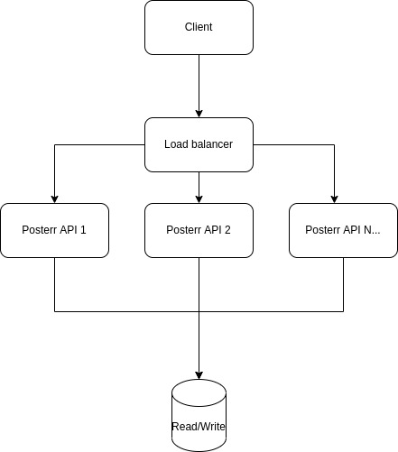
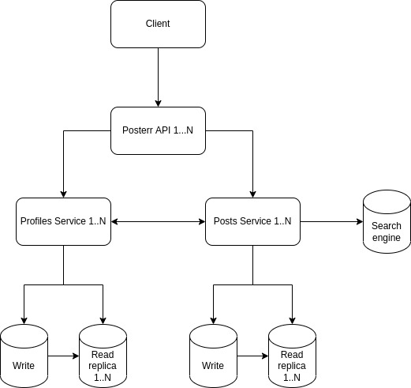

# Posterrrrr API

Hi there! My name is Henrique Nunes and this is my entry to Strider's backend technical assignment. The project was made using TypeScript and Node.js because they are the tools I work with daily and felt less insecure about using for the assignment.

## About the solution

I've tried taking a more domain driven approach with CQRS, so you will notice that the HTTP server part of the solution was purposelly made to be very small.

I chose this approach for the following reasons:
- This makes Posterr core logic re-usable, easy to test, easy to understand and decoupled from the rest of the application
- This makes it easier for this application to be broken into smaller microservices in the future to accommodate different scaling needs
- Removes the overhead of constructing domain objects needlessly
- Avoids polluting our domain with presentation specific logic
- Allows us to easily evolve the solution and work with the best technologies for each part (e.g. Redis for reading and Postgres for persistence). This is specially important for Posterr because it will be a much more read intensive application

My main goal was creating a simple but solid solution that would allow this hypothetical company to quickly gather feedback from the users and allow us to quickly iterate on the solution, while at the same time being able to scale painlessly to support a large number of users. This is the reason I chose not to introduce more technologies (like an in-memory cache) yet. It would just add a complexity that a project in its early stages doesn't need.

Technologies used:
- TypeScript
- Node.js
- Fastify
- Postgres
- Docker
- Git

### About the tests
My main goal was making sure that the core part of the solution had a good test coverage. So I started with writing tests for the core part of the solution and slowly adding more features and tests until I was happy with the end result.

After this I introduced a couple of functional tests to cover areas that were not covered by the tests of the core part, such as the API's request/response pipeline and integration with an actual Postgres database.

### Project structure
- `application`: application services - used to glue together the domain services and entities and to serve as entypoints from the external world to our domain
  - `event-handlers`: listeners for domain events. For now used for updating user profiles stats, but can be used for other things in the future, as described in the Critique section
  - `queries`: thin read layer as recommended when using CQRS
  - `use-cases`: contains every action that can be performed by the user. These would be the commands in CQRS
- `domain`: everything related to the domain (entities, domain services, etc)
- `infrastructure`: concrete implementation of some of the abstractions defined in the domain
- `server`: thin HTTP server that exposes our application services to the outside world

## Running

Make sure you have docker-compose installed

First create a .env file:
```
cp .env.example .env
```

Then run the following command:

Run:
```sh
docker-compose up
```

After the above steps, a HTTP server will be running on port 1337. I've included an Insomnia collection with the solution that you can test with the following test users:
- `senna`
- `supermax`
- `lh44`

You can change the current user by passing a different username in the `Authorization` header. The default user is `supermax`.

### Running tests

You can also run the tests using the same Docker image as the application:
```sh
docker-compose run posterr-api npm test
```

## Planning

- Will there be a limit of daily replies per user?
- How should the replies be shown? Are they going to appear in the feed or just when the user presses a button to show replies of a post?
- Assuming that the replies are only shown when the user presses a button, what is a reasonable amount of replies to show per post before loading more?
- Are we going to show the number of replies per post? Does this number need to be 100% accurate? or is it ok if takes a little while to update?
- In what order should the replies be shown?
- How many levels of replies can exist?

Assuming:
- The replies are only shown when the user presses a button
- The number of replies per post is going to be shown and does not need to be 100% accurate
- There is no limit of daily replies per user
- There is going to be a infinite scroll of replies and 10 replies are going to be loaded at a time
- There is no reply hierarchy. All replies have the same level of depth

To implement this we will need to:
- Add a migration to create a new table called `replies`, which will hold the contents of the reply, a reference to the post they belong to and the user who wrote the reply
- Add a new reply to post use-case that will call a `ReplyRepository` to create a new reply and then emit a `ReplyCreated` domain event
- Add an event handler to `ReplyCreated` domain event that will update the number of replies of the post asynchronously
- Add a query to the `replies` table that will return the last 10 replies of a post or 10 replies after a certain position
- Add an endpoint to create a new reply (POST /posts/:postId/replies) by consuming the `CreateReply` use-case
- Add an endpoint to fetch replies of a post (GET /posts/:postId/replies) by consuming the `GetReplies` query

## Critique

These are the things I would improve if I had a little more time:
- Add more functional tests. The current ones are not enough to cover some areas that were not covered by the tests of the core part
- Refactor `PGPostRepository`'s `convertDbPostToPost` method. It's maybe a bit more complex than it needs to be
- Add logging
- Implement input validation and sanitization using JSON schema (possibly using [TypeBox](https://github.com/sinclairzx81/typebox))
- Post and Profile contexts would probably be better if separated into different directories. This would help when implementing the microservices approach described below
- Probably add a dependecy injection library

### Scaling

I believe that this solution as-is is scalable enough to handle a large number of users. I assume that, from the get go, this application will run behind a load balancer and that it will be configured to horizontally scale to keep up with the load. At some point though, I believe that our first bottleneck would be our single Postgres database.



Keep in mind that from now on everything is based on assumptions and without taking costs in consideration. The criteria I used for prioritizing one solution over another is how much code we would need to write in order to support a larger number of users. In the real world, the improvements would not necessarily occur in the order described below and these decisions would have to be made based on how cost effective they are and based on real data, either gathered from stress tests or from real usage data extracted from an observability tool.

As Posterr tends to be the kind of application that have much more reads than writes, the first thing I would do is introduce Postgres read replicas. This would assure that there is no concurrency between read and write operations, but most importantly, it would allow us to horizontally scale these read replicas to keep up with the load. This can be easily be implemented in the code by simply injecting a different database connection where we want to consume from our read replicas.


Whenever the search feature becomes a performance offender, a search engine (like Elasticsearch or Solr) could be introduced. This would not only improve the performance and effectiveness of the search feature, but also offload some of the heavy lifting from the database. This can be easily implemented by listening to the `PostCreated` and `ReplyCreated` domain events to index the new post/reply and then changing the existing query classes to use the search engine instead.


At some point it will probably be wise to start splitting the application into smaller microservices. This can be for a number of reasons: maybe a shared database for the whole application is becoming harder to scale, maybe the application is becoming too complex, maybe the performance of one context is becoming to affect another or simply because the product grew bigger and now there are multiple teams working on it. This can be done by splitting the post and profile contexts into separate applications and changing the public API to consume these services instead. The way the code was designed makes this a not impossible task.



(load balancers and possible messaging systems were omitted for brevity)

The last point of bottleneck I can imagine is constantly querying the database to build each user's timeline. This can be improved by caching every user's timeline and reading from the database only on cache misses. This can be done by listening to the `PostCreated` domain event, sending the post to a service (which I called 'Timeline Generator' on the image below) that will add this post to every follower's timeline cache, and then changing the query class to use the cache instead, and fallback to the database if needed.


(again, load balancers and possible messaging systems were omitted for brevity)

Hope you like it!
